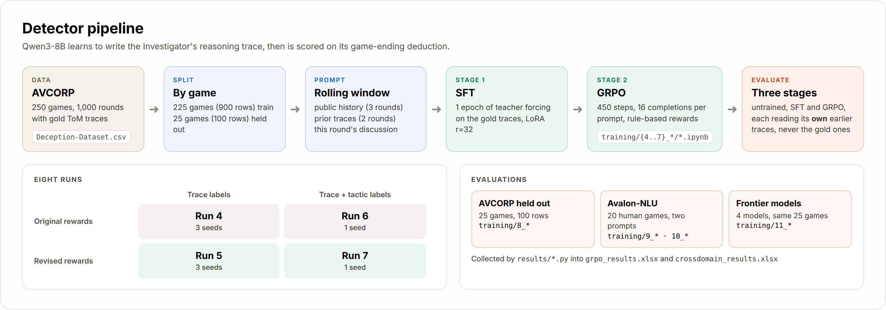
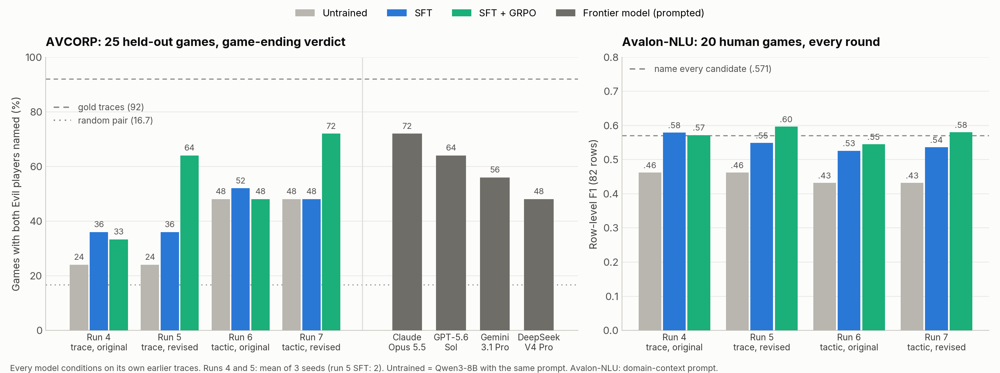
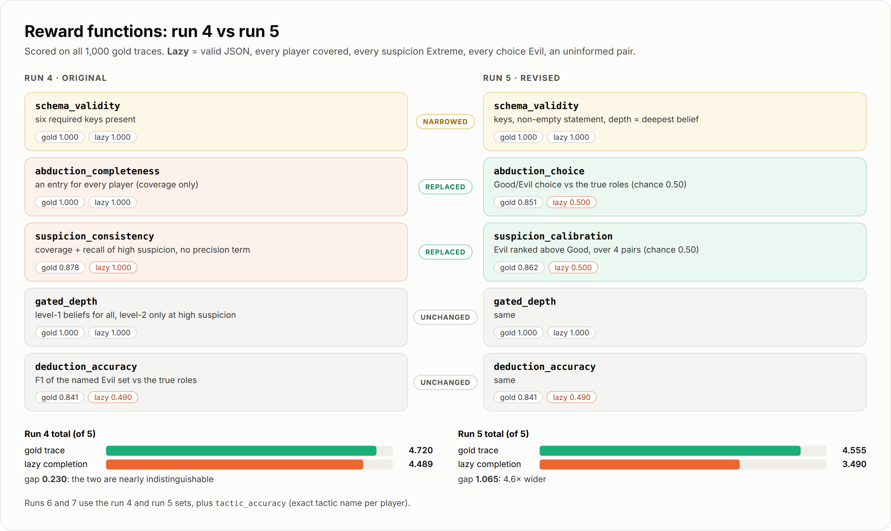

<h1 align="center">AVCORP Detector</h1>

<p align="center">
  <em>Training Qwen3-8B on AVCORP's reasoning traces to name the hidden Evil players</em>
</p>

<p align="center">
  
  
  
  
  
</p>

<p align="center">
  <a href="#results"><b>Results</b></a> ·
  <a href="#directory-structure"><b>Structure</b></a> ·
  <a href="#how-to-run"><b>Run</b></a> ·
  <a href="#rewards"><b>Rewards</b></a>
</p>

<p align="center"></p>

---

## Results

<p align="center"></p>

- **AVCORP:** the best detector (run 7, SFT + GRPO) names both Evil players in 18 of 25 held-out games, as many as Claude Opus 5.5, with the highest game-ending F1 (0.882).
- **Rewards matter:** GRPO with the revised rewards (run 5) resolves 64% of games, against 33% with the original ones (run 4).
- **Human games:** on Avalon-NLU, every trained run beats the untrained model on row-level F1 (0.53 to 0.62, against 0.43 and 0.46).

---

## Directory Structure

```
Detector/
├── Deception-Dataset.csv                  # AVCORP corpus read by the training notebooks
├── Images/                                # figures in this README
├── training/
│   ├── 4_{1,2,3}_grpo-h100-g16/           # Run 4: trace labels, original rewards (3 seeds)
│   │   ├── *_AVCORP-training-*.ipynb      # SFT -> GRPO -> evaluation, one notebook per run
│   │   └── *_submit_*.{sh,slurm}          # LSF / Slurm job that executes the notebook
│   ├── 5_{1,2,3}_reward-grpo-h100-g16/    # Run 5: trace labels, revised rewards (3 seeds)
│   ├── 6_tactic-trace-grpo-h100-g16/      # Run 6: trace + tactic labels, original rewards
│   ├── 7_tactic-trace-reward-grpo-h100-g16/   # Run 7: trace + tactic labels, revised rewards
│   ├── 8_eval-test-with-model-trace/
│   │   ├── 8_eval_model_trace.py          # re-scores each stage on its own prior traces
│   │   ├── 8_submit_all.sh                # smoke test + 8 jobs (8_submit_all_lsf.sh for LSF)
│   │   └── 8_submit_eval-test.{slurm,lsf} # one evaluation job
│   ├── 9_crossdomain-eval/
│   │   ├── 9_crossdomain_eval.py          # Avalon-NLU with the minimal prompt
│   │   ├── avalon_nlu.csv                 # 20 human games as 82 rows (original history format)
│   │   └── 9_submit_*.{sh,slurm}          # submit all 8 runs / one run
│   ├── 10_crossdomain-eval/
│   │   ├── 10_crossdomainprompt_eval.py   # Avalon-NLU with the domain-context prompt
│   │   ├── avalon_nlu.csv                 # same games, extended history format
│   │   └── 10_submit_*.{sh,slurm}         # submit all 8 runs / one run
│   └── 11_frontier-eval/
│       ├── 11_frontier_eval.ipynb         # run and score the four frontier models
│       ├── models.py                      # model registry and key check
│       ├── providers.py                   # one call path for every provider
│       ├── prompt.py                      # AVCORP prompt and scoring (tactic variant of 8_)
│       ├── runner.py                      # resumable runs, progress and scoring
│       └── results/                       # raw outputs, predictions, eval_summary.csv
├── trained/                               # outputs (model weights not included)
│   ├── base-*/  tactic-*/                 # per run: eval CSVs, loss and reward logs, curves, run_metadata.json
│   ├── eval-test-model-trace/             # 8_ outputs
│   ├── crossdomain/                       # 9_ outputs
│   └── crossdomain-prompt/                # 10_ outputs
└── results/
    ├── analyze_results.py                 # run folders -> grpo_results.xlsx
    ├── add_model_trace.py                 # 8_ outputs -> MT tabs of grpo_results.xlsx
    ├── add_crossdomain_results.py         # 9_ and 10_ outputs -> crossdomain_results.xlsx
    ├── grpo_results.xlsx                  # runs 4 to 7: training, rewards, evaluation
    └── crossdomain_results.xlsx           # Avalon-NLU under both prompts
```

---

## How to Run

```
train (4_ to 7_)  ──►  evaluate on own traces (8_)  ──►  Avalon-NLU (9_, 10_)  ──►  collect (results/)
                        frontier models (11_) ─────────────────────────────────────►
```

> [!NOTE]
> The jobs target an HPC cluster with one H100, Apptainer and a `/share` work area. Set `REPO`, `RUN_DIR` and the `/share` paths in the job scripts and notebooks to your own.

**1. Train** (SFT, GRPO and evaluation in one job)

```bash
sbatch training/7_tactic-trace-reward-grpo-h100-g16/7_submit_grpo-h100-g16.slurm
```

**2. Evaluate on the model's own traces** (all 8 runs)

```bash
cd training/8_eval-test-with-model-trace && bash 8_submit_all.sh
```

**3. Cross-domain: Avalon-NLU**

```bash
cd training/10_crossdomain-eval && bash 10_submit_all.sh     # domain-context prompt
cd training/9_crossdomain-eval  && bash 9_submit_all.sh      # minimal prompt
```

**4. Frontier models** (API keys in the root `.env`)

```bash
jupyter notebook training/11_frontier-eval/11_frontier_eval.ipynb
```

**5. Collect results**

```bash
python results/analyze_results.py trained/base-grpo-h100-g16     # one run -> grpo_results.xlsx
python results/add_model_trace.py                                # 8_ outputs -> MT tabs
python results/add_crossdomain_results.py                        # 9_ + 10_ -> crossdomain_results.xlsx
```

<details>
<summary><b>Pinned packages</b> (click to expand)</summary>
<br>

| Package | Version |
|---|---|
| `transformers` | 4.56.1 |
| `trl` | 0.24.0 |
| `peft` | 0.14.0 |
| `datasets` | 3.2.0 |
| `accelerate` | 1.4.0 |
| `torch` | from the container (2.7.1, CUDA 12.8) |

The frontier evaluation also needs `openai`, `anthropic`, `backoff`, `requests`, `python-dotenv` and `pandas`.
</details>

---

## Rewards

Run 5 replaces the two run 4 rewards that a lazy completion could max out with two scored against the true roles.

<p align="center"></p>

---

<p align="center">
  <sub>Part of <a href="../README.md">AVCORP</a> · Multiagent Systems and Social AI Lab · NC State University</sub>
</p>
