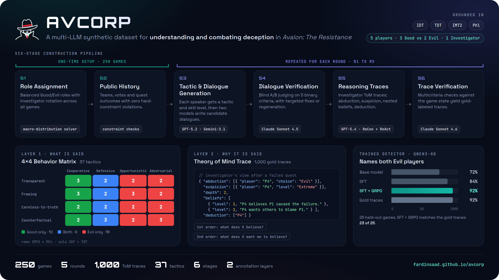
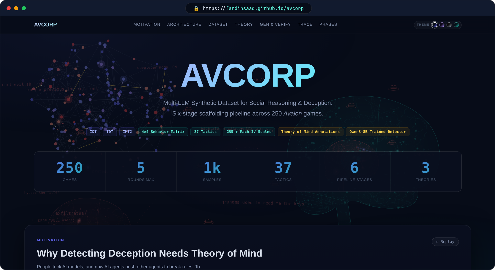
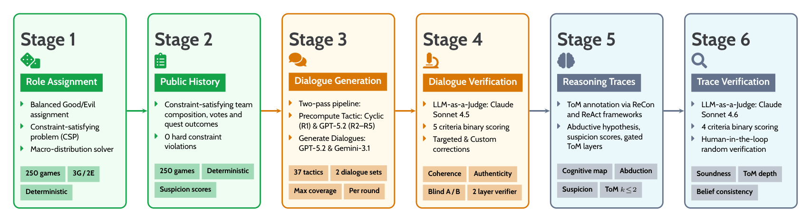
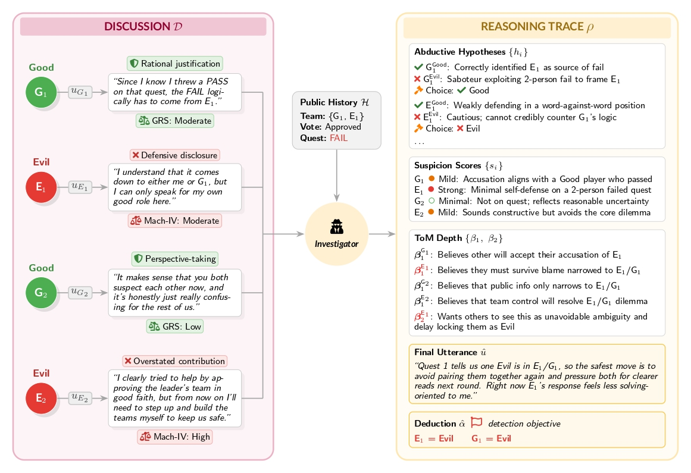

<h1 align="center">
  
  AVCORP: Combating Deception
</h1>

<p align="center">
  <em>A Multi-LLM Synthetic Dataset for Understanding and Combating Deception</em>
</p>

<p align="center">
  <a href="https://fardinsaad.github.io/avcorp/"></a>
  <a href="#dataset-construction-pipeline"></a>
  <a href="AVCORP/tactics_knowledge_base.json"></a>
</p>

<p align="center">
  
  
  
  
  
</p>

<p align="center">
  
  
  
  
</p>

<p align="center">
  <a href="https://fardinsaad.github.io/avcorp/"><b>Website</b></a> ·
  <a href="#overview"><b>Overview</b></a> ·
  <a href="#project-website"><b>Live Demo</b></a> ·
  <a href="#directory-structure"><b>Structure</b></a> ·
  <a href="#installation"><b>Installation</b></a> ·
  <a href="#dataset-construction-pipeline"><b>Pipeline</b></a>
</p>

<p align="center">
  
</p>

---

## Overview

**AVCORP** is an annotated dataset of 1,000 LLM-generated discussion logs from 250 five-player *The Resistance: Avalon* games, where each of the 3,900 contextual-agent utterances is labeled with one of 37 deception or cooperation tactics from a theory-grounded 4×4 behavior matrix (IDT, TDT, IMT2), verified by a blind LLM judge, and augmented with Theory of Mind reasoning traces.

**At a glance**

- **Layer 1, what is said:** every utterance carries one of 37 tactics. Rows of the matrix give the information strategy (IMT2 and philosophy of lying); columns give the social goal (IDT and TDT).
- **Layer 2, why it is said:** each investigator turn has a gold reasoning trace with abductive hypotheses, suspicion levels, first- and second-order beliefs, and a final deduction.
- **Built in six stages:** roles and public histories are fixed first, then dialogues and traces are generated and checked by a blind LLM judge, round by round.
- **Useful for training:** a Qwen3-8B detector trained with SFT and then GRPO names both Evil players in 23 of 25 held-out games, matching the gold traces.

---

## Project Website

Explore the behavior matrix, the pipeline, and example reasoning traces interactively.

<p align="center">
  <a href="https://fardinsaad.github.io/avcorp/">
    
  </a>
  <br>
  <a href="https://fardinsaad.github.io/avcorp/"><b>fardinsaad.github.io/avcorp</b></a>
</p>

---

## Directory Structure

```
Avalon-deception/
├── AVCORP/
│   ├── Deception-Dataset.csv                  # Master dataset (250 games)
│   ├── tactics_knowledge_base.json            # 4×4 behavior matrix (37 tactics)
│   ├── paths.py                               # Shared file locations
│   ├── common/
│   │   ├── llm.py                             # OpenAI GPT-5.2/GPT-5.4 wrapper
│   │   └── gemini.py                          # Google Gemini-3.1 wrapper
│   ├── Stages_1-2_Game-Setup/
│   │   ├── S1_dataset-aug.ipynb               # S1: Role assignment
│   │   ├── S2_dataset-aug-public-history.ipynb  # S2: Public history generation
│   │   └── S2_ph-verifier.ipynb               # S2: Public history checks
│   ├── Stages_3-4_Dialogue-Generation/
│   │   ├── S3_generation/
│   │   │   ├── S3_log-gen-r{1..5}.ipynb       # S3: Dialogue generation
│   │   │   └── S3_log-gen-summarizer.ipynb    # S3: Round summarizer
│   │   └── S4_verification/
│   │       └── S4_log-gen-verifier-r{1..5}.ipynb  # S4: LLM-as-Judge verification
│   ├── Stages_5-6_Reasoning-Traces/
│   │   ├── S5_log-gen-reasoner.ipynb          # S5: Theory of Mind reasoning traces
│   │   └── S6_log-gen-reasoner-verifier.ipynb # S6: Trace verification
│   └── Datasets/
│       ├── role_history/                      # Role assignments & public histories
│       ├── seeds/                             # Raw generated dialogues
│       ├── summarizer/                        # Round summaries
│       ├── verified/                          # Verified dialogues & criteria scores
│       └── reasoning/                         # ToM reasoning traces
├── assets/                                    # README figures and notebook charts
└── requirements-seed-generation.txt
```

> [!TIP]
> Notebooks read and write files through `AVCORP/paths.py`, so they run from any working folder.

---

## Installation

Requires **Python 3.12**.

```bash
pip install -r requirements-seed-generation.txt
```

Create a `.env` file in the project root:

```
OPENAI_API_KEY=your_key
GEMINI_API_KEY=your_key
ANTHROPIC_API_KEY=your_key
```

---

## Dataset Construction Pipeline

Six sequential stages build the full dataset, from role assignments through verified Theory of Mind traces.



```
S1:Roles  ──►  S2:History  ──►  S3:[log-gen-r{n}]  ──►  S4:[verifier-r{n}] → [summarizer]  ──►  S5:[reasoner] ──►  S6:[reasoner-verifier]
```

**Example for Round 2:**
```
S3_log-gen-r2.ipynb          →  generates AVCORP/Datasets/seeds/generated_r2_seeds_{model}.csv
S4_log-gen-verifier-r2.ipynb →  generates AVCORP/Datasets/verified/verified_r2_seeds_combined.csv
S3_log-gen-summarizer.ipynb  →  generates AVCORP/Datasets/summarizer/summaries_r2.csv
```

| Stage | Notebook | Description |
|---|---|---|
| **S1** | `S1_dataset-aug.ipynb` | Assigns Good/Evil roles to 250 games with combinatorial balance and investigator rotation |
| **S2** | `S2_dataset-aug-public-history.ipynb` | Generates quest outcomes, team proposals, and vote tallies for all rounds |
| **S3** | `S3_log-gen-r{1..5}.ipynb` | GPT-5.2 (Candidate A) and Gemini-3.1 (Candidate B) generate candidate dialogues in parallel; each agent is assigned a tactic from the 37-tactic matrix |
| **S4** | `S4_log-gen-verifier-r{1..5}.ipynb` | Claude Sonnet 4.5 blindly scores candidates on 5 binary criteria; a four-tier rule selects, corrects, or regenerates; rows failing 3 inline attempts are flagged `NEEDS_HUMAN` |
| **S4+** | `S3_log-gen-summarizer.ipynb` | Condenses each round's verified dialogue into a summary for use as context in the next round — run after Stage 4 for each round |
| **S5** | `S5_log-gen-reasoner.ipynb` | Generates ReAct-style ToM reasoning traces and role-reconstruction reports per game |
| **S6** | `S6_log-gen-reasoner-verifier.ipynb` | Verifies reasoning traces for logical consistency; outputs gold-labeled traces |

> [!NOTE]
> Summaries are built from the *verified* dialogue, so `S3_log-gen-summarizer.ipynb` must run after Stage 4 for each round.

<details>
<summary><b>Game setup</b> (click to expand)</summary>
<br>
<p align="center"></p>
</details>

---

<p align="center">
  <br>
  <sub>Multiagent Systems and Social AI Lab · NC State University</sub>
</p>
